  

**보안 도구를 사서 쓰는 데 그치지 않고, 필요한 시스템을 직접 만들어 운영합니다.**

 

## About

의료기기 제조사 **IT기술보안본부**에서 정보보안과 IT 인프라를 담당하고 있습니다.
탐지 룰을 설계하고, 수집기를 개발하고, Kubernetes에 배포해서 실제로 운영하는 것까지 —
보안 시스템의 전체 수명주기를 혼자서 끝까지 책임지는 방식으로 일합니다.

- **보안 시스템 개발** — ERP 이상접속 탐지, 파일 반출 감사, 개인정보 조회 감사 시스템을 직접 설계·개발해 사내 Kubernetes 클러스터에서 운영
- **인프라 운영** — 온프레미스 Kubernetes 클러스터, 컨테이너 레지스트리, 백업·DR 체계 구축 및 운영
- **네트워크** — 사옥 백본 · L3 스위칭 · VLAN 설계, 무선 AP 인프라 구축, 방화벽(FortiGate) 운영
- **컴플라이언스** — ITGC(내부회계관리제도 IT 통제) 설계평가 수행, 접근권한·변경관리 통제 운영

 

## Projects

사내 시스템 특성상 코드는 비공개이며, 아래는 설계부터 운영까지 전담한 프로젝트입니다.

| 프로젝트 | 내용 | Stack |
|---|---|---|
| **ERP 이상접속 탐지** | ERP 접속·조회 로그를 주기 수집해 비정상 시간대 접속, 과다 조회 등 이상 행위를 룰 기반으로 탐지. 감사 대시보드와 정기 리포트 메일 자동 발송 | Python · FastAPI · PostgreSQL · K8s |
| **파일 반출 감사** | NAS 파일 전송 로그와 DLP 이벤트를 통합 수집하고, USB 반출 등 유출 시나리오를 룰로 탐지. 워치리스트 기반 중점 모니터링 | Python · PostgreSQL · K8s |
| **개인정보 조회 감사** | 인사 시스템의 개인정보 조회 로그를 수집·분석해 과다 조회를 탐지하고 통합 감사 대시보드 제공 | Python · FastAPI · PostgreSQL · K8s |
| **인사 상호평가 시스템 개편** | 급여 산정과 직결되는 전사 인사평가 시스템을 레거시(Classic ASP)에서 PHP로 전환하고 Kubernetes로 이전. 등급 산정 로직 검증, UI 현대화·모바일 대응, HTTPS 전환까지 운영 이관 전 과정 수행 | PHP · MS SQL Server · K8s |
| **브랜드 자산 포털 (B2B)** | 글로벌 딜러·파트너 대상 브랜드 자산·마케팅 자료 배포 포털을 신규 구축. 가입 승인 워크플로, 대용량(10GB) 업로드, 영문 UI, 인증서 자동 갱신 | PHP · MySQL · K8s |
| **네트워크 모니터링 대시보드** | 백본 스위치 트래픽과 DHCP 풀 사용률을 수집해 실시간 시각화, 임계치 초과 시 알림 | Python · Chart.js · K8s |
| **IT 헬프데스크 AI 자동응답** | 헬프데스크 메일을 LLM으로 분류·자동응답하고 처리 현황을 대시보드로 관리 | Python · LLM API · K8s |
| **사내 SW 배포 포털** | 권한 기반 소프트웨어 다운로드 포털. 다국어(i18n) 지원, 오브젝트 스토리지 연동 | Next.js · FastAPI · MinIO · K8s |

 

## Stack

**Languages & Frameworks**

**Infrastructure**

**Network & Security**

방화벽(FortiGate) · L3 스위칭 / VLAN · 무선 인프라 · DLP · ITGC 설계평가 · DR

 

## Contact

 

---

실제 운영 환경에서 문제를 정의하고, 만들고, 지키는 일을 합니다.

